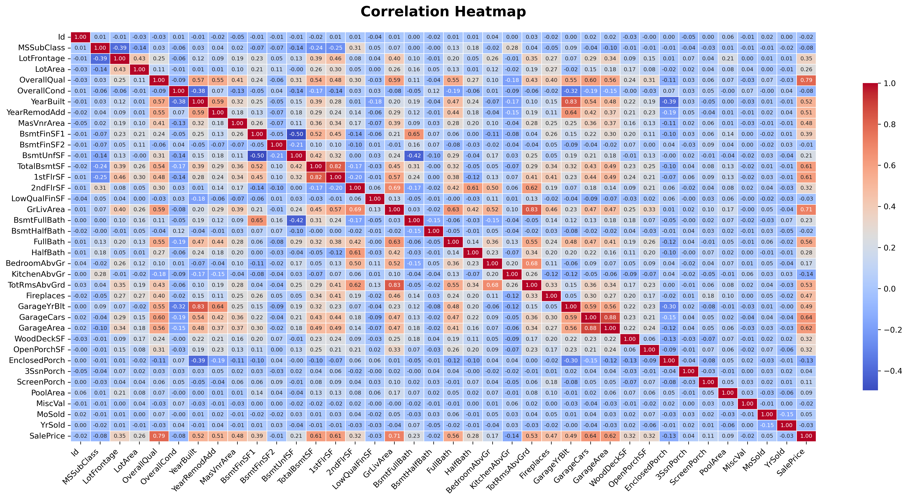

# EDA & Modelling for Housing Data

This project analyzes housing data and builds predictive models to estimate house prices using regression techniques. It includes exploratory data analysis (EDA), feature engineering, preprocessing, and predictive modelling.

## Overview

This project leverages a house prices dataset with a mix of numeric and categorical features. It automatically:
- Performs enhanced EDA (correlation heatmap, histograms, boxplots, pairplots, and missing value analysis).
- Preprocesses data by imputing missing values, one-hot encoding categorical features, and standardizing numeric features.
- Trains and evaluates multiple regression models (Linear Regression and Random Forest with hyperparameter tuning).
- Saves evaluation metrics, plots (e.g., predictions vs. actual values), and the trained models.

## Features

-	Enhanced Exploratory Data Analysis (EDA)
	-	Saves dataset summary and missing values analysis.
	-	Generates a correlation heatmap, histograms, boxplots, and (if feasible) a pairplot.
-	Robust Preprocessing
	-	Imputes missing numeric values with the median and categorical values with the mode.
	-	One-hot encodes categorical features.
	-	Standardizes all features for modeling.
-	Expanded Modelling
	-	Trains Linear Regression and Random Forest models.
	-	Performs hyperparameter tuning for Random Forest using GridSearchCV.
	-	Evaluates models with cross-validation and test metrics (MSE and R²).
	-	Generates prediction plots comparing actual vs. predicted house prices.
-	Logging and Output Management
	-	Uses Python’s logging module for clear runtime feedback.
	-	Saves all outputs to the results/ folder for easy review.


## Test Output

Below is a test output from the `perform_eda` function, showing the correlation heatmap:



## Steps to Run

1. Clone the repository

```
git clone https://github.com/your_username/HousePricesPrediction.git
cd HousePricesPrediction
```

2. Install dependencies

```
pip install -r requirements.txt
```

3. Run the program to execute the pipeline

```
python scripts/main.py
```

## Results

-	All outputs including EDA plots (e.g., correlation heatmap, histograms, boxplots, pairplot), model evaluation metrics, prediction plots, and saved models are generated in the results/ folder.
-	A CSV summary (model_results_summary.csv) details the performance metrics for each trained model.


## Notes

-	The project assumes that the dataset contains a target column named "SalePrice" along with a mix of numeric and categorical features.
-	If you encounter any issues with high cardinality in categorical variables, consider alternative encoding strategies.
-	Additional feature engineering and outlier handling can be added as needed based on domain knowledge.
